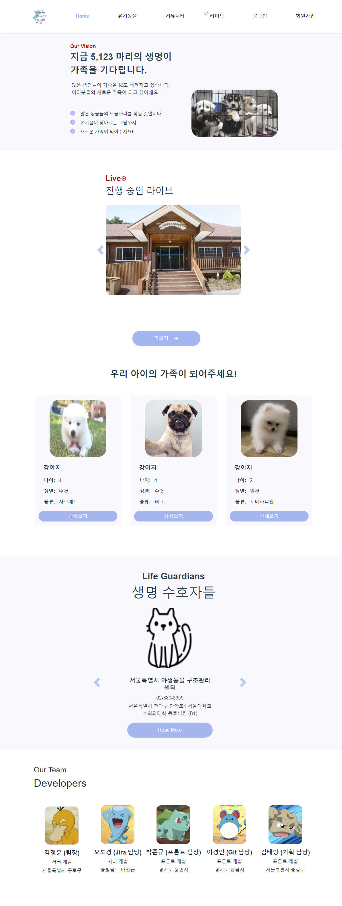

# 📰README --petmily

### ✏️ 소개

- 프로젝트 기간 : *2021.7.12(월) ~ 2021.8.20(금)*

- 개발자 : 박준규(리더), 이경민(git 담당), 김태랑(스타일링)

- 와이어프레임 : Figma

- 로고: 미리캔버스

- 목표 :

  - vue3 구조 이해

  - 유기 동물 라이브를 통해 입양 활성화

  - ## 아무거나 적어주세요... 떠오르는게 없어요

#### 

### ✏️ 피그마

### ✏️ 구성 화면 -> 이미지를 넣는게 좋을까요 빼는게 좋을까요??

- Home.vue : 메인 화면 

  - 사이트의 목표

  - 진행중인 라이브 방송
  - 유기동물 목록
  - 유기동물 보호 단체
  - 개발자들

- shelter

  - 보호소 정보 및 지도, 등록한 동물 정보를 conponents로 사용하여 보호소의 상세 정보를 보여줌

- live

  - 방송정보

- animal

  - 유기동물 목록
  - 필터와 검색 기능을 구현
  - 각 동물에 대한 디테일 페이지 구현

- accounts

  - 기관 및 개인 회원으로 구분하여 가입, 비밀번호 찾기, 마이페이지등을 구현

  

------------

### 과정

Home.vue 

Shelter.vue

Live.vue

Animal.vue

Accounts.vue